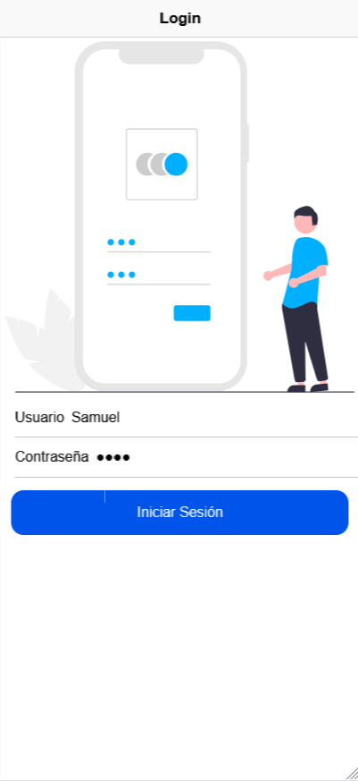
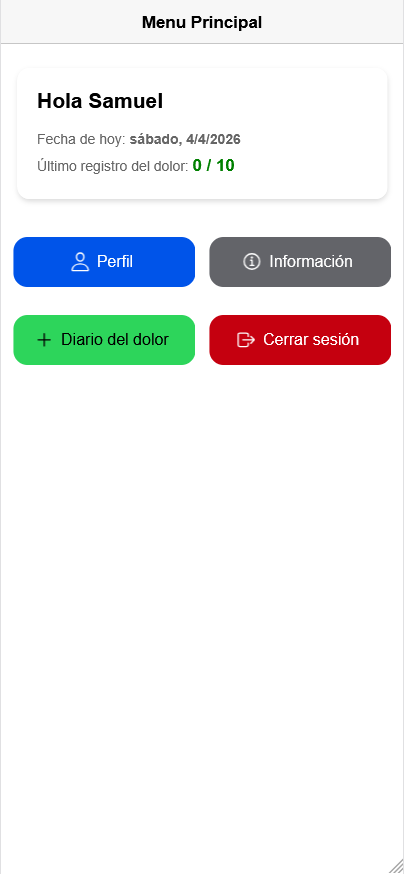
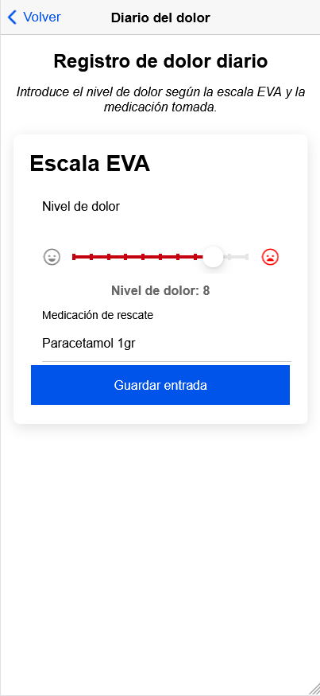
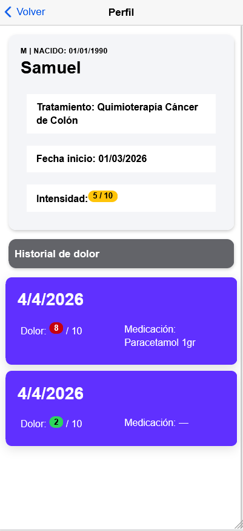
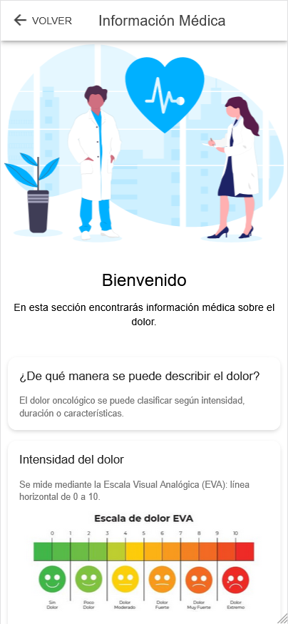
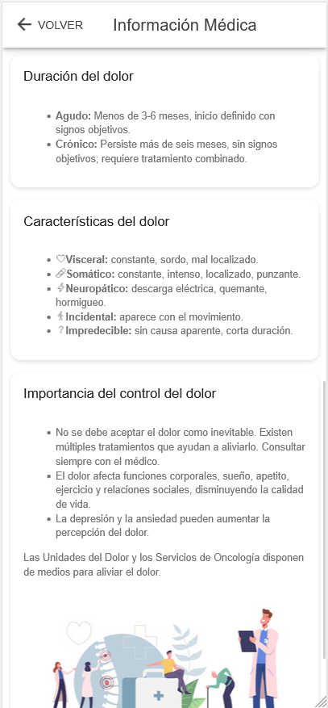
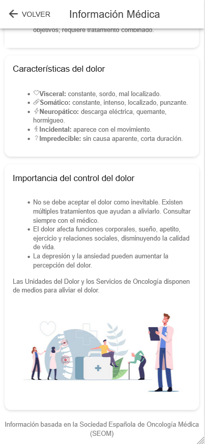

# Pain Diary App

A mobile application built with **Ionic** and **Angular** to help users record pain levels, medications, and treatment-related information. This project was developed as part of my frontend and mobile development portfolio, with a focus on healthcare-oriented user experience and clear symptom tracking.

## Overview

Pain Diary App provides a simple way for users to monitor daily pain intensity, register medications, and review symptom history over time. The project was designed as a health-focused mobile interface prototype that combines usability, structured data entry, and accessible navigation.

## Key Features

- **User Login**  
  Simple username-based access to personalize the app experience.

- **Home Dashboard**  
  Displays a welcome message, current date, and the latest pain record.

- **Pain Diary**  
  Allows users to log daily pain levels, medications, and notes.

- **Profile Section**  
  Shows user information and a summary of historical pain records.

- **Medical Information**  
  Provides educational content related to pain management and treatment.

- **Responsive Design**  
  Optimized for mobile devices using Ionic components and Angular architecture.

## Screenshots

| Login | Home | Pain Diary |
|---|---|---|
|  |  |  |

| Profile | Medical information | Medical information |  Medical information |
|---|---|---|---|
|  |   |  |   | 


## Tech Stack

- Ionic
- Angular
- TypeScript
- HTML
- SCSS

## Installation

1. Clone the repository:

```bash
git clone https://github.com/luciaperezz/App_Pain.git
```

2. Navigate to the project folder:

```bash
cd App_Pain
```

3. Install dependencies:

```bash
npm install
```

4. Start the development server:

```bash
ionic serve
```

## Usage

After launching the app locally, users can log in, navigate through the dashboard, create pain entries, review previous records, and explore the medical information section. The application serves as a frontend prototype demonstrating mobile UI design, routing, and structured health-data input.

## Project Structure

```bash
src/
  app/
  assets/
  environments/
```

## Learning Goals

This project was created to strengthen practical skills in:

- Mobile application development with Ionic and Angular
- Responsive interface design
- Frontend architecture and routing
- Healthcare-focused application design

## Disclaimer

This repository represents a portfolio and learning project. It is not intended to replace professional medical advice, diagnosis, or treatment.
